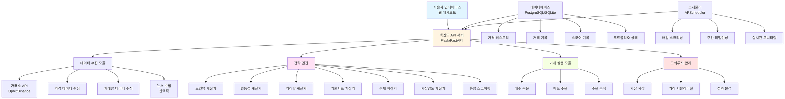

```mermaid
---
config:
  flowchart:
    useMaxWidth: false
---
graph TB
    A[사용자 인터페이스<br/>웹 대시보드] --> B[백엔드 API 서버<br/>Flask/FastAPI]
    B --> C[데이터 수집 모듈]
    B --> D[전략 엔진]
    B --> E[거래 실행 모듈]
    B --> F[모의투자 관리]
    
    C --> C1[거래소 API<br/>Upbit/Binance]
    C --> C2[가격 데이터 수집]
    C --> C3[거래량 데이터 수집]
    C --> C4[뉴스 수집<br/>선택적]
    
    D --> D1[모멘텀 계산기]
    D --> D2[변동성 계산기]
    D --> D3[거래량 계산기]
    D --> D4[기술지표 계산기]
    D --> D5[추세 계산기]
    D --> D6[시장강도 계산기]
    D --> D7[통합 스코어링]
    
    E --> E1[매수 주문]
    E --> E2[매도 주문]
    E --> E3[주문 추적]
    
    F --> F1[가상 지갑]
    F --> F2[거래 시뮬레이션]
    F --> F3[성과 분석]
    
    G[데이터베이스<br/>PostgreSQL/SQLite] --> B
    G --> G1[가격 히스토리]
    G --> G2[거래 기록]
    G --> G3[스코어 기록]
    G --> G4[포트폴리오 상태]
    
    H[스케줄러<br/>APScheduler] --> B
    H --> H1[매일 스크리닝]
    H --> H2[주간 리밸런싱]
    H --> H3[실시간 모니터링]
    
    style A fill:#e1f5ff
    style B fill:#fff4e1
    style D fill:#ffe1f5
    style E fill:#f5ffe1
    style F fill:#ffe1e1

```